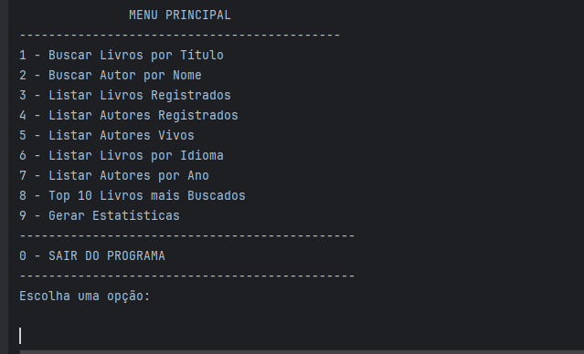

<h1 align="center"> LiterAlura </h1>

Challenge ONE Back End - Java.

 

  

## 🚀 Tecnologias

Esse projeto foi desenvolvido com as seguintes tecnologias:

- Java
- Trello
- Spring Boot
- Postgres

## 💻 Projeto

Uma aplicação que usa uma api externa de livros, assim podera buscar livros, autores entre outras funcionalidades.